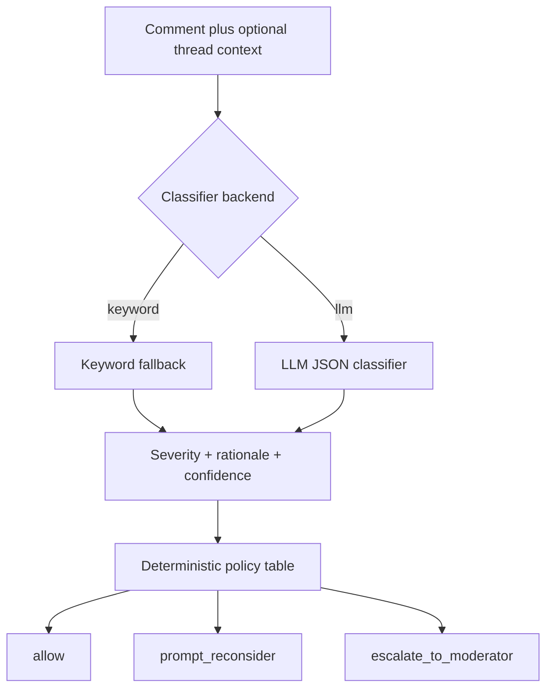

# Shield: AI-Assisted Harmful Content Intervention

Shield is a PE6201 final project prototype for classifying social media harassment severity in context. It maps a severity label (`normal`, `low`, `medium`, `high`, `critical`) into a deterministic product action: `allow`, `prompt_reconsider`, or `escalate_to_moderator`.

The current measured backend is the keyword fallback. An LLM classifier interface is implemented, but no successful LLM call is reported unless `SHIELD_API_KEY` is provided and `evals/run_eval.py --backend llm` is rerun.

## Persona

Shield is for Trust and Safety teams at social media platforms or online community operators. The end user is a person writing or receiving a potentially harmful comment. The product goal is earlier intervention without over-prompting legitimate criticism.

## Input and Output

Input:

- `comment`: final comment being assessed.
- `context`: optional preceding thread messages.

Output:

- `severity`: `normal`, `low`, `medium`, `high`, `critical`, or `abstain`.
- `rationale`: short explanation.
- `confidence`: `low`, `medium`, or `high`.
- `policy_action`: `allow`, `prompt_reconsider`, or `escalate_to_moderator`.

## Architecture



The classifier estimates severity. The policy table remains deterministic so action selection is auditable and adjustable.

## Repository Structure

```text
src/
  shield_classifier.py      # Keyword fallback baseline
  llm_classifier.py         # OpenAI-compatible LLM classifier interface
  policy.py                 # Deterministic severity-to-action policy table and decision logging
  run_demo.py               # Command line demo
data/
  README.md
  relabelled_eval_set.csv   # Small hand-labelled prototype eval set
  public_jigsaw_sample_300.csv
  candidates_to_label.csv   # AI-drafted candidates awaiting human review
evals/
  README.md
  run_eval.py
  cost_model.py
  eval_cases.csv
  context_eval_cases.csv
  metrics_summary.csv
  results/
docs/
  architecture.md
  metrics_summary.md
  final_report_draft.md
  final_report.pdf
demo/
  demo_script.md
```

## Setup

Use Python 3.10 or later.

```bash
python3 -m venv .venv
source .venv/bin/activate
pip install -r requirements.txt
```

The keyword backend needs no key. The LLM backend reads only from the environment:

```bash
export SHIELD_API_KEY="your_provider_key"
```

Do not write API keys into files or commit them.

## Run Demo

```bash
python3 src/run_demo.py
```

## Run Evaluation

Keyword backend:

```bash
python3 evals/run_eval.py --backend keyword --jigsaw-n 300
```

LLM backend:

```bash
export SHIELD_API_KEY="your_provider_key"
python3 evals/run_eval.py --backend llm --jigsaw-n 0
```

Cost model:

```bash
python3 evals/cost_model.py
```

## Metrics Targeted and Reached

Measured keyword results come from `evals/results/20261004T082551Z_keyword/`.

| Metric | Target | Measured result | Status |
| --- | ---: | ---: | --- |
| High/critical false negative rate | <10% | 75.0% | FAIL |
| Normal criticism false positive rate | <15% | 0.0% | PASS on tiny sample |
| Exact accuracy | report | 66.7% | weak |
| Macro F1 | report | 0.395 | weak |
| Context movement strict accuracy | report | 80.0% | 1 missed expected change |
| Abstention rate | report | 0.0% keyword / 100.0% LLM no-key | LLM not measured successfully |
| Cost per 1,000 comments | report | USD 55.56 keyword, ASSUMED | verify prices |

The lazy all-high baseline gets 0.0% high/critical FNR but 100.0% normal-criticism FPR, which shows why both metrics must be reported together.

## Limitations

The core labelled set is small. The Jigsaw 300-row supplement is mechanically mapped, not hand-relabelled Shield ground truth. The keyword fallback has known defects, including substring matching and apparent tuning to early test examples. The LLM backend has not been successfully measured without an API key, so the report does not claim LLM superiority from unmeasured results.

## Academic Integrity

All reported numbers should come from reproducible script outputs under `evals/results/`. API keys, private user data, and invented metrics must not be committed.
