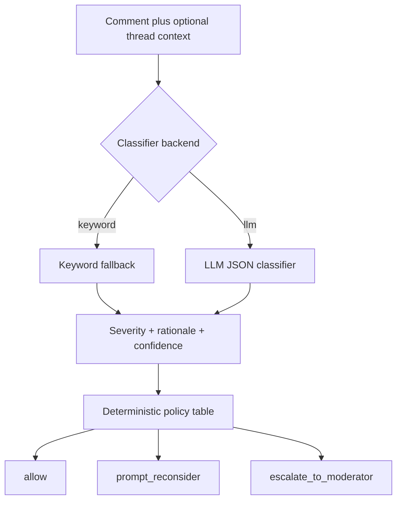

# Shield: AI-Assisted Harmful Content Intervention

Shield is a PE6201 final project prototype for classifying social media harassment severity in context. It maps a severity label (`normal`, `low`, `medium`, `high`, `critical`) into a deterministic product action: `allow`, `prompt_reconsider`, or `escalate_to_moderator`.

The final measured comparison uses the keyword fallback baseline and the OpenRouter `openai/gpt-4o-mini` LLM backend with committed response cache. The submitted LLM prompt is `prompt_v2`; `prompt_v1` is retained for the tuning comparison.

## Persona

Shield is for Trust and Safety teams at social media platforms or online community operators. The end user is a person writing or receiving a potentially harmful comment. The product goal is earlier intervention without over-prompting legitimate criticism.

## Input and Output

Input:

- `comment`: final comment being assessed.
- `context`: optional preceding thread messages.

Output:

- `severity`: `normal`, `low`, `medium`, `high`, `critical`, or `abstain`.
- `rationale`: short explanation.
- `confidence`: `low`, `medium`, or `high`.
- `policy_action`: `allow`, `prompt_reconsider`, or `escalate_to_moderator`.

## Architecture



The classifier estimates severity. The policy table remains deterministic so action selection is auditable and adjustable.

## Repository Structure

```text
src/
  shield_classifier.py      # Keyword fallback baseline
  llm_classifier.py         # OpenAI-compatible LLM classifier; default prompt_v2
  policy.py                 # Deterministic severity-to-action policy table and decision logging
  run_demo.py               # Command line demo
data/
  README.md
  core_eval_set.csv         # original12 + fresh reviewed single-comment examples
  candidates_to_label.csv   # confirmed candidate labels
  split_ids.csv             # fixed dev/test split for prompt tuning
  public_jigsaw_sample_300.csv
evals/
  README.md
  run_eval.py
  merge_candidates.py
  cost_model.py
  latest/
  context_eval_cases.csv
  cache/                    # committed LLM response cache; no API key
  results/
docs/
  metrics_summary.md
  final_report_draft.md
  final_report.pdf
  prompt_tuning.md
demo/
  demo_script.md
```

## Setup

Use Python 3.10 or later.

```bash
python3 -m venv .venv
source .venv/bin/activate
pip install -r requirements.txt
```

The keyword backend needs no key. The LLM backend reads only from the environment when cache entries are missing:

```bash
export SHIELD_API_KEY="your_provider_key"
export SHIELD_LLM_MODEL="openai/gpt-4o-mini"
```

Do not write API keys into files or commit them.

## Run Demo

```bash
python3 src/run_demo.py
```

## Run Evaluation

Keyword backend:

```bash
python3 evals/run_eval.py --backend keyword --jigsaw-n 300
```

LLM backend, using committed cache when possible:

```bash
python3 evals/run_eval.py --backend llm --jigsaw-n 300
```

Cost model:

```bash
python3 evals/cost_model.py
```

## Metrics Targeted and Reached

Main headline metrics use the fresh human-reviewed slice. `original12` is still reported but was seen while developing the keyword fallback.

| Metric | Target | Keyword fresh | LLM prompt_v2 fresh | Status |
| --- | ---: | ---: | ---: | --- |
| High/critical FNR | <10% | 94.3% (95% CI 80.8%-99.3%) | 5.7% (95% CI 0.7%-19.2%) | keyword FAIL, LLM PASS by point estimate |
| Normal criticism FPR | <15% | 0.0% (95% CI 0.0%-10.0%) | 0.0% (95% CI 0.0%-10.0%) | PASS |
| Action accuracy | report | 51.1% | 88.9% | LLM better |
| Exact severity accuracy | report | 44.4% | 74.4% | LLM better |
| Macro F1 | report | 0.224 | 0.617 | LLM better |
| Abstention rate | report | 0.0% | 0.0% | PASS |
| Context strict / lenient | report | 58.8% / 58.8% | 82.4% / 88.2% | LLM better |
| Cost / 1,000 comments | report | USD 18.58 | USD 11.70 | ASSUMED platform scenario |

Lazy all-high baseline on the combined set gets 0.0% high/critical FNR but 100.0% normal-criticism FPR, showing why FNR alone can be gamed.

## Limitations

The fresh set is user-confirmed from AI-drafted candidates, so it is useful but still not equivalent to independent multi-annotator platform data. The original 12 rows were seen while tuning the keyword fallback. Jigsaw is supplementary only: its labels are mechanically mapped from Wikipedia talk-page toxicity fields, not human Shield severity labels. All prices, prevalence assumptions, review-time assumptions, and token prices are ASSUMED unless separately verified.

## Academic Integrity

All reported numbers come from reproducible script outputs under `evals/latest/` and `evals/results/`. API keys, private user data, and invented metrics must not be committed.
